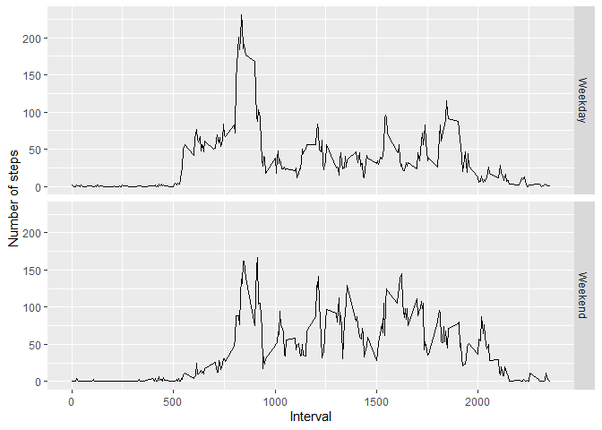

## Loading and preprocessing the data

1. Load the data. 


```r
temp <- tempfile()
download.file('https://d396qusza40orc.cloudfront.net/repdata%2Fdata%2Factivity.zip',temp)
data<-read.csv(unz(temp,'activity.csv'))
```

## What is mean total number of steps taken per day?

1. Calculate the total number of steps taken per day.


```r
data1<-tapply(data$steps,data$date,sum,na.rm=TRUE) 
data1 ## total no. of steps taken per day
```

```
## 2012-10-01 2012-10-02 2012-10-03 2012-10-04 2012-10-05 2012-10-06 2012-10-07 
##          0        126      11352      12116      13294      15420      11015 
## 2012-10-08 2012-10-09 2012-10-10 2012-10-11 2012-10-12 2012-10-13 2012-10-14 
##          0      12811       9900      10304      17382      12426      15098 
## 2012-10-15 2012-10-16 2012-10-17 2012-10-18 2012-10-19 2012-10-20 2012-10-21 
##      10139      15084      13452      10056      11829      10395       8821 
## 2012-10-22 2012-10-23 2012-10-24 2012-10-25 2012-10-26 2012-10-27 2012-10-28 
##      13460       8918       8355       2492       6778      10119      11458 
## 2012-10-29 2012-10-30 2012-10-31 2012-11-01 2012-11-02 2012-11-03 2012-11-04 
##       5018       9819      15414          0      10600      10571          0 
## 2012-11-05 2012-11-06 2012-11-07 2012-11-08 2012-11-09 2012-11-10 2012-11-11 
##      10439       8334      12883       3219          0          0      12608 
## 2012-11-12 2012-11-13 2012-11-14 2012-11-15 2012-11-16 2012-11-17 2012-11-18 
##      10765       7336          0         41       5441      14339      15110 
## 2012-11-19 2012-11-20 2012-11-21 2012-11-22 2012-11-23 2012-11-24 2012-11-25 
##       8841       4472      12787      20427      21194      14478      11834 
## 2012-11-26 2012-11-27 2012-11-28 2012-11-29 2012-11-30 
##      11162      13646      10183       7047          0
```

2. Make a histogram of the total number of steps taken each day.


```r
data2<-aggregate(steps~date,data,sum,na.rm=TRUE)
hist(data2$steps) ## histogram of the total number of steps taken each day
```

<!-- -->

3. Calculate and report the mean and median of the total number of steps taken per day.


```r
mean(data1) ## mean of the total number of steps taken per day 
```

```
## [1] 9354.23
```

```r
median(data1) ## median of the total number of steps taken per day
```

```
## [1] 10395
```

## What is the average daily activity pattern?

1. Make a time series plot of the 5-minute interval (x-axis) and the average number of steps taken, averaged across all days (y-axis).


```r
data3<-aggregate(steps~interval,data,mean,na.rm=TRUE) 
plot(data3$interval,data3$steps,type='l') ##  time series plot of the 5-minute interval and the average number of steps taken, averaged across all days
```

<!-- -->

2. Which 5-minute interval, on average across all the days in the dataset, contains the maximum number of steps?


```r
maxsteps<-max(data3$steps)
data3[data3$steps==maxsteps,]$interval ## the 5-minute interval which contains the maximum number of steps
```

```
## [1] 835
```

## Imputing missing values

1. Calculate and report the total number of missing values in the dataset (i.e. the total number of rows with NAs).


```r
nrow(data[!complete.cases(data), ]) ## total number of missing values in the dataset
```

```
## [1] 2304
```

2. Devise a strategy for filling in all of the missing values in the dataset.


```r
data4<-data
for (i in 1:nrow(data4)){
  if(is.na(data4$steps[i])==TRUE){
    replacement<-data3[data3$interval==data4$interval[i],]$steps
    data4$steps[i]<-replacement
  } ## filling in all of the missing values in the dataset with the mean for that 5-minute interval
  else{
    data4$steps[i]<-data$steps[i]
  }
} 
```

3. Create a new dataset that is equal to the original dataset but with the missing data filled in.


```r
head(data4) ## new dataset that is equal to the original dataset but with the missing data filled in  
```

```
##       steps       date interval
## 1 1.7169811 2012-10-01        0
## 2 0.3396226 2012-10-01        5
## 3 0.1320755 2012-10-01       10
## 4 0.1509434 2012-10-01       15
## 5 0.0754717 2012-10-01       20
## 6 2.0943396 2012-10-01       25
```

4. Make a histogram of the total number of steps taken each day and Calculate and report the mean and median total number of steps taken per day. Do these values differ from the estimates from the first part of the assignment? What is the impact of imputing missing data on the estimates of the total daily number of steps?


```r
data5<-tapply(data4$steps,data4$date,sum,na.rm=TRUE) 
data5 ## total no. of steps taken per day
```

```
## 2012-10-01 2012-10-02 2012-10-03 2012-10-04 2012-10-05 2012-10-06 2012-10-07 
##   10766.19     126.00   11352.00   12116.00   13294.00   15420.00   11015.00 
## 2012-10-08 2012-10-09 2012-10-10 2012-10-11 2012-10-12 2012-10-13 2012-10-14 
##   10766.19   12811.00    9900.00   10304.00   17382.00   12426.00   15098.00 
## 2012-10-15 2012-10-16 2012-10-17 2012-10-18 2012-10-19 2012-10-20 2012-10-21 
##   10139.00   15084.00   13452.00   10056.00   11829.00   10395.00    8821.00 
## 2012-10-22 2012-10-23 2012-10-24 2012-10-25 2012-10-26 2012-10-27 2012-10-28 
##   13460.00    8918.00    8355.00    2492.00    6778.00   10119.00   11458.00 
## 2012-10-29 2012-10-30 2012-10-31 2012-11-01 2012-11-02 2012-11-03 2012-11-04 
##    5018.00    9819.00   15414.00   10766.19   10600.00   10571.00   10766.19 
## 2012-11-05 2012-11-06 2012-11-07 2012-11-08 2012-11-09 2012-11-10 2012-11-11 
##   10439.00    8334.00   12883.00    3219.00   10766.19   10766.19   12608.00 
## 2012-11-12 2012-11-13 2012-11-14 2012-11-15 2012-11-16 2012-11-17 2012-11-18 
##   10765.00    7336.00   10766.19      41.00    5441.00   14339.00   15110.00 
## 2012-11-19 2012-11-20 2012-11-21 2012-11-22 2012-11-23 2012-11-24 2012-11-25 
##    8841.00    4472.00   12787.00   20427.00   21194.00   14478.00   11834.00 
## 2012-11-26 2012-11-27 2012-11-28 2012-11-29 2012-11-30 
##   11162.00   13646.00   10183.00    7047.00   10766.19
```

```r
data6<-aggregate(steps~date,data4,sum,na.rm=TRUE)
hist(data6$steps) ## histogram of the total number of steps taken each day
```

<!-- -->

```r
mean(data5) ## mean of the total number of steps taken per day 
```

```
## [1] 10766.19
```

```r
median(data5) ## median of the total number of steps taken per day  
```

```
## [1] 10766.19
```
There is a higher mean and median after imputing the missing values.
There is a higher number of days with 10k-15k steps after imputing the missing values.

## Are there differences in activity patterns between weekdays and weekends?

1. Create a new factor variable in the dataset with two levels – “weekday” and “weekend” indicating whether a given date is a weekday or weekend day.


```r
data4$day<-weekdays(as.Date(data4$date))
data4$week<-ifelse(data4$day %in% c('Saturday','Sunday'),'Weekend','Weekday') 
head(data4)## created new factor variable in the dataset with two levels
```

```
##       steps       date interval    day    week
## 1 1.7169811 2012-10-01        0 Monday Weekday
## 2 0.3396226 2012-10-01        5 Monday Weekday
## 3 0.1320755 2012-10-01       10 Monday Weekday
## 4 0.1509434 2012-10-01       15 Monday Weekday
## 5 0.0754717 2012-10-01       20 Monday Weekday
## 6 2.0943396 2012-10-01       25 Monday Weekday
```

2. Make a panel plot containing a time series plot of the 5-minute interval (x-axis) and the average number of steps taken, averaged across all weekday days or weekend days (y-axis). 


```r
data7<-aggregate(steps~interval+week,data4,mean,na.rm=TRUE)
library(ggplot2)
p<-ggplot(data7,aes(x=interval,y=steps))+geom_line()+facet_grid(week~.)+labs(x='Interval',y='Number of steps')
print(p) ## plot containing a time series plot of the 5-minute interval and the average number of steps taken
```

<!-- -->
